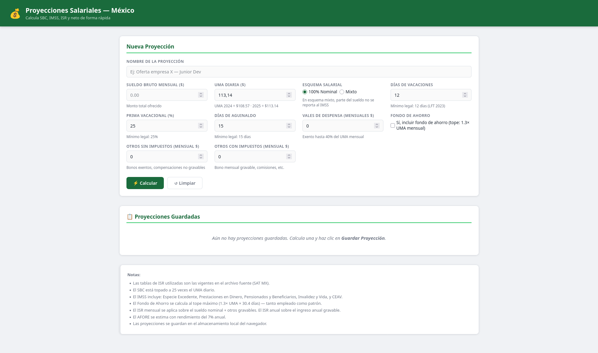

# Proyecciones Salariales México 💰


Una herramienta web para calcular sueldos netos, impuestos y prestaciones de ley en México de forma rápida y precisa.

## 🔗 Demo en vivo
Puedes probar la herramienta directamente aquí: [https://proyecciones.hbautista.com](https://proyecciones.hbautista.com)

## 🚀 Descripción
Este proyecto permite a los usuarios (empleados, reclutadores o especialistas en RH) realizar proyecciones salariales detalladas. A diferencia de una calculadora simple, esta herramienta considera variables complejas como el tope de la UMA para el SBC, cálculos de fondo de ahorro y diferentes esquemas de contratación.

<p align="center">
  
</p>

## ✨ Características
- **Cálculo de ISR:** Basado en las tablas anuales y mensuales vigentes.
- **Cálculo de IMSS:** Desglose detallado de las cuotas obrero-patronales.
- **Esquemas Múltiples:** Soporte para sueldos 100% nominales y esquemas mixtos.
- **Comparador:** Guarda múltiples proyecciones en el navegador para comparar ofertas laborales.
- **Fondo de Ahorro:** Cálculo automatizado basado en topes legales.

## 🛠️ Tecnologías utilizadas
- **HTML5:** Estructura semántica.
- **CSS3:** Diseño responsivo mediante variables CSS y Flexbox/Grid.
- **JavaScript (ES6+):** Lógica de cálculo y manipulación del DOM sin dependencias externas.

## 📦 Instalación y Uso
No requiere instalación de servidores ni bases de datos.

1. Clona el repositorio:
   ```bash
   git clone [https://github.com/hbautistaf/proyecciones.git](https://github.com/hbautistaf/proyecciones.git)
   ```
2. Abre el archivo index.html en cualquier navegador moderno.

## 📋 Funcionalidades Técnicas

- Persistencia: Uso de localStorage para mantener las proyecciones guardadas tras refrescar la página.
- Validaciones: Cálculos dinámicos que se actualizan al cambiar el tipo de esquema.
- SBC: El Salario Base de Cotización se calcula automáticamente con las prestaciones ingresadas y se topa a 25 UMAs según la ley.

## 📄 Licencia

Este proyecto está bajo la licencia GNU General Public License v3.0. Consulta el archivo LICENSE para más detalles.